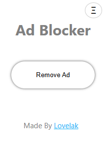

# Ad Blocker Chrome Extension

I made this simple Ad Blocker Chrome extension that modifies the current tab's URL to help bypass ads on YouTube by altering the domain. It features a popup interface with a single button to trigger the URL modification.

## What's New (v0.1.1)

- **Continue Playback:** When modifying the YouTube URL, the extension now preserves your current video position, so playback continues from where you left off.
- **Improved Experience:** No more restarting videos when removing ads!

## Features

- One-click button to modify the current tab's URL.
- Designed for YouTube ad bypassing.
- **Keeps your current playback position on YouTube videos.**
- Clean and simple popup UI.

## Installation

1. Clone or download this repository to your local machine.
2. Open Chrome and go to `chrome://extensions/`.
3. Enable "Developer mode" (top right).
4. Click "Load unpacked" and select the project directory.

## Usage

1. Navigate to a YouTube video.
2. Click the Ad Blocker extension icon in your browser toolbar.
3. In the popup, click the **Remove Ad** button.
4. The page will reload with a modified URL and continue playing from your current position.

## Screenshots

**New Version v0.0.1**

**New Version v0.1.1**

## Project Structure

- [`manifest.json`](manifest.json): Chrome extension manifest file.
- [`popup.html`](popup.html): Popup UI for the extension.
- [`popup.js`](popup.js): JavaScript logic for modifying the URL.
- [`content.js`](content.js): Content script for retrieving YouTube playback time.
- `assets/`: Folder for images and other assets.

## Credits

Made By [Lovelak](http://lovelak.rf.gd)

---

**Disclaimer:** This extension is for educational purposes only.
